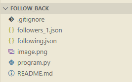

# Instagram Non-Followers Checker

Este repositório contém um **script simples em Python** para identificar quais usuários do Instagram que você segue **não te seguem de volta**.  
Ele processa arquivos JSON exportados da sua conta e gera uma lista organizada dos perfis que não fazem follow back.

---

## 📝 Como Usar

1. **Exportar os dados do Instagram:**
   - Abra o Instagram no navegador e vá em **Configurações > Privacidade e Segurança > Baixar Dados**.
   - Solicite o download dos seus dados. O Instagram enviará um arquivo ZIP por e-mail contendo suas informações, incluindo seguidores e quem você segue.
   - Extraia o ZIP. Dentro, você encontrará uma pasta `connections` com os arquivos:

    ```text
    connections/
    └── followers_and_following/
        ├── following.json
        └── followers_1.json
    ```

2. **Colocar os arquivos no projeto:**
   - Copie os arquivos "following.json" e "followers_1.json" **para a raiz do projeto**, ou seja, na mesma pasta onde está o script Python.
   
   

3. **Executar o script:**
   - Certifique-se de ter **Python 3.x** instalado.  
   - Abra o terminal, navegue até a pasta do projeto e execute:

     ```bash
     py program.py
     ```

   - O script irá exibir:
     - Todos os seus seguidores.  
     - Usuários que você segue mas que não te seguem de volta.  
     - Total de perfis que não seguem de volta.

---

## ⚠️ Aviso de Segurança

- Este script deve ser usado **apenas com os dados da sua própria conta do Instagram**.  
- **Não compartilhe arquivos JSON contendo informações de seguidores ou seguidos de outras pessoas**, para proteger a privacidade.  
- O script **não realiza nenhuma automação na plataforma** (como seguir, curtir ou enviar mensagens) e apenas analisa dados exportados manualmente pelo Instagram.  
- Qualquer modificação para acessar ou interagir diretamente com o Instagram via bots ou scraping **pode violar os Termos de Uso da plataforma**.
